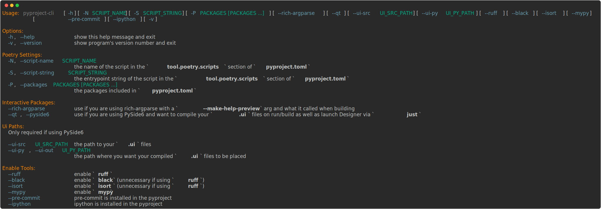

# pyproject-cli
A handy tool for configuring a `pyproject.toml` file generated by `poetry`, as well as generating `justfile` and `.pre-commit-config.yaml` files based on what tools you are using.



## Install
```bash
just install
```
*OR*
```bash
poetry install
poetry build
py -m pipx install ./dist/`ls -t dist | head -n2 | grep whl`
```
*__NOTE:__* Use `python3` instead of `py` if you don't have it installed.

## Development
### Setup
```bash
just setup
```
*OR*
```bash
poetry install
poetry run mypy . 2> /dev/null ; yes | poetry run mypy --install-types
poetry run pre-commit install
```

### Run
```bash
just run ARGS_HERE
```
*OR*
```bash
poetry run pyproject-cli ARGS_HERE
```

### Formatting
```bash
just format
```
*OR*
```bash
poetry run ruff check --select I --fix .
poetry run ruff format .
```

### Linting
```bash
just lint
```
*OR*
```bash
poetry run ruff check --select I --fix .
poetry run ruff format .
poetry run ruff check .
poetry run mypy .
```